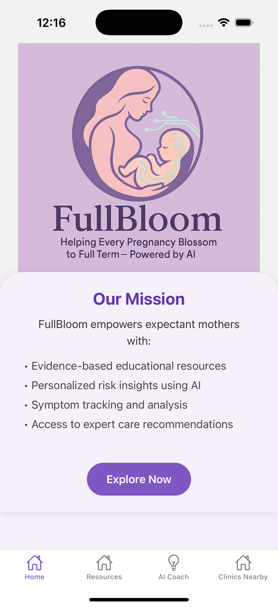
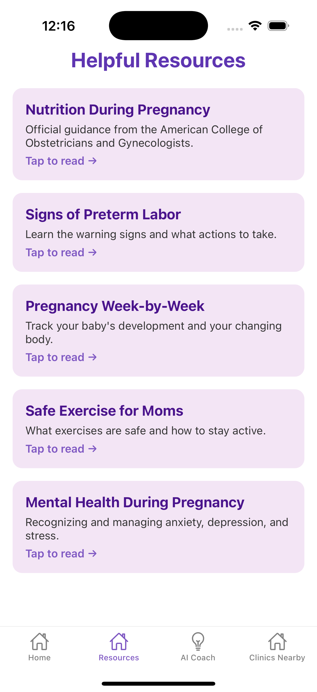
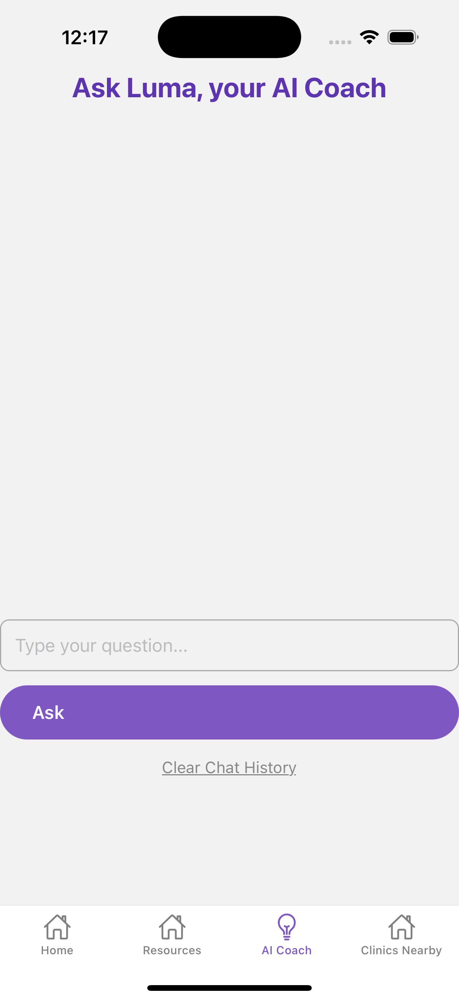
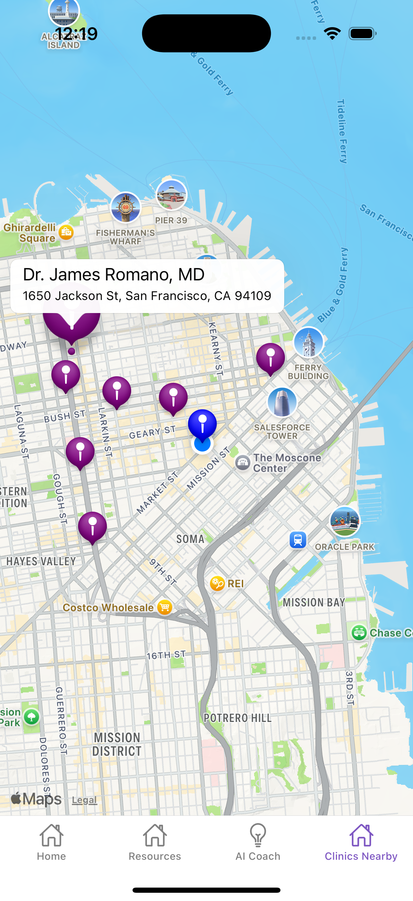

# 🌸 FullBloom – Empowering Maternal Health with AI

**FullBloom** is a mobile application designed to support expecting mothers by providing personalized guidance, educational resources, local clinic access, and AI-powered coaching — all in one compassionate platform. Our mission is to reduce preventable preterm births and improve maternal health outcomes by empowering women with accessible, intelligent tools during their pregnancy journey.

---

## 📸 Screenshots


### 🏠 Home Screen


- **Purpose**: Provides a welcoming introduction and easy navigation.
- **Features**:
  - Motivational messaging with animation
  - Navigation bar to other core features
- **Tech Stack**:
  - React Native with `react-native-gesture-handler`
  - Animated components using `Animated API`

---

### 📚 Resources


- **Purpose**: Delivers curated, medically verified content on prenatal health, diet, and early warning signs.
- **Features**:
  - Scrollable, categorized content cards
  - Built-in reading interface
- **Tech Stack**:
  - React Native ScrollViews
  - Content manually curated in JSON + Markdown

---

### 🤖 AI Coach


- **Purpose**: Offers conversational support and smart responses via a GPT-based LLM.
- **Features**:
  - Natural language conversation with an AI pregnancy coach
  - Tailored responses based on user inputs
  - Context-aware follow-ups and resources
- **Tech Stack**:
  - OpenAI / Groq-powered LLM
  - React Native chat UI
  - AsyncStorage for session handling

---

### 🏥 Clinics Nearby


- **Purpose**: Shows real-time nearby pregnancy clinics for in-person support.
- **Features**:
  - Location permission + geolocation
  - Real-time search via Google Places API
  - Pins on interactive map
- **Tech Stack**:
  - `expo-location` for permissions
  - `react-native-maps`
  - Google Maps Places API integration

---

## 🛠️ Tech Stack Overview

| Feature            | Technology Used                                  |
|--------------------|--------------------------------------------------|
| App Framework      | React Native (Expo)                              |
| Navigation         | `@react-navigation/native`, Stack + Tabs         |
| Maps               | `react-native-maps`, Google Places API           |
| AI Chatbot         | OpenAI / Groq API + custom prompt design         |
| Authentication     | Supabase Auth + OAuth integrations               |
| State Management   | React `useState`, `useEffect`, and `AsyncStorage`|
| Deployment Ready   | Expo Go / EAS for publishing                     |

---

## 🚀 Future Roadmap

Here’s what’s coming in **FullBloom v2.0+**:

- ✅ **App Store / Google Play Publication**
  - Full deployment pipeline using EAS (Expo Application Services)
- 🔐 **Improved Authentication**
  - Fully working integrations with:
    - Google Login (native mobile)
    - Microsoft Login
    - Apple Sign-In
- 👤 **Profile Tab**
  - View and update maternal info, due dates, and preferences
- 📊 **Symptom Tracker**
  - Log symptoms with daily/weekly tracking
  - AI-powered analysis and alerts for critical trends
- 🧠 **Expanded AI Capabilities**
  - More medically informed prompts
  - Contextual memory across sessions
  - Optional voice/text input
- 🌍 **Multilingual Support**
  - Spanish, Hindi, and more for global accessibility

---

## 📦 Installation (Local Development)

### 1. Clone the repository

```bash
git clone https://github.com/your-username/fullbloom-app.git
cd fullbloom-app
